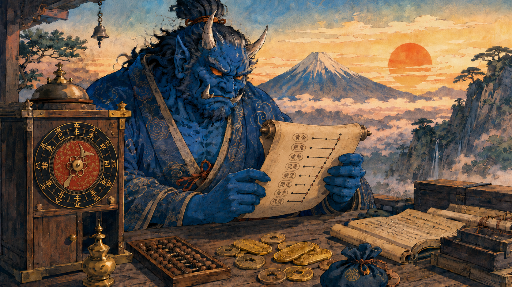

# Tickoni Content ⏱️👹

The creative universe of Tickoni — lore, stories, characters, worlds, and release narratives.

## 📜 The Story

Tickoni is set on the Ledger Sea, a financial world without a shore. Market islands, exchange towers, rumor ports, and whale tracks form the backdrop for a story about trust, boundaries, and what it means for a guardian to say *no*.

Long ago, every guardian carried a **seal** naming a duty with a boundary. When the Order of the Oni forgot those boundaries, Tickoni refused an order, had its own seal torn away, and was cast out. Now it sails the Ledger Sea to recover the scattered fragments of the ancient Contract — not to inherit the laws, but to **prove** them. Each one must survive the sea before it can be worn.

Every encounter **orders** the world into something bounded: a wish becomes a ticket, a ticket becomes a proposal, a proposal becomes an order. And each recovered fragment restores a seal that can no longer be ignored, corrupted, or torn away.

## 🗺️ What's Here

| Directory | Contents |
| --------- | -------- |
| `lore/` | Chapter files — the ongoing narrative of the Tickoni world |
| `releases/` | Release notes — story-driven changelogs for each version |
| `banners/` | Banner and header artwork for the project |
| `CONTRIBUTING.md` | Contribution terms and submission guidelines |

## ✍️ Contributing

All contributions are welcome. If you're interested in submitting creative material, please read **[CONTRIBUTING.md](CONTRIBUTING.md)** first — it explains how submissions are handled and what rights apply.

## 🛡️ License

All content is copyrighted © 2026 Victor Genin (DeepRND). See **[LICENSE](LICENSE)** for terms covering publication, reproduction, and commercial use.
